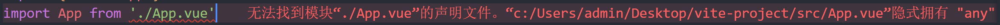

# 准备工作
## 应用Element-plus插件
插件被重复使用,国际化应用失败也是这里出错
[](./images/4.png)
```
app.use(ElementPlus)
app.use(ElementPlus, {
  locale: zhCn,
})
```
## 安装sass遇到的问题
[](./images/image.png)
### 治标不治本的两个方法： 
1.把sass变量在需要使用的组件中再次声明
[](./images/3.png)
2.把@use换成@import 但会有警告，因为@import已经弃用
## 找不到模块问题

在vue3项目里，ts文件是识别不了vue文件
找到项目的env.d.ts文件
加上
```
declare module "*.vue" {
  import type { DefineComponent } from "vue";
  const vueComponent: DefineComponent<{}, {}, any>;
  export default vueComponent;
}
```
## moke接口
通过命令行 npm install -D vite-plugin-mock mockjs 安装的vite-plugin-mock 之后发现再vite.config.ts里边报错 
viteMockServe({ localEnabled: command === 'serve', })  类型“{ localEnabled: boolean; }”的参数不能赋给类型“ViteMockOptions”的参数。
对象字面量只能指定已知属性，并且“localEnabled”不在类型“ViteMockOptions”中。
解决办法：
卸载vite-plugin-mock
```
npm uninstall vite-plugin-mock
```
安装 2.9.6版本
```
npm install mockjs vite-plugin-mock@2.9.6 -D
```
为啥发送get 请求就获取不到信息
## 环境变量
**项目开发过程中，至少会经历开发环境、测试环境和生产环境(即正式环境)三个阶段。不同阶段请求的状态(如接口地址等)不尽相同，若手动切换接口地址是相当繁琐且易出错的。于是环境变量配置的需求就应运而生，我们只需做简单的配置，把环境状态切换的工作交给代码。**

开发环境（development）
顾名思义，开发使用的环境，每位开发人员在自己的dev分支上干活，开发到一定程度，同事会合并代码，进行联调。

测试环境（testing）
测试同事干活的环境啦，一般会由测试同事自己来部署，然后在此环境进行测试

生产环境（production）
生产环境是指正式提供对外服务的，一般会关掉错误报告，打开错误日志。(正式提供给客户使用的环境。)

注意:一般情况下，一个环境对应一台服务器,也有的公司开发与测试环境是一台服务器！！！

项目根目录分别添加 开发、生产和测试环境的文件!
```
.env.development
.env.production
.env.test
```
文件内容

```
# 变量必须以 VITE_ 为前缀才能暴露给外部读取
NODE_ENV = 'development'
VITE_APP_TITLE = '硅谷甄选运营平台'
VITE_APP_BASE_API = '/dev-api'
```

```
NODE_ENV = 'production'
VITE_APP_TITLE = '硅谷甄选运营平台'
VITE_APP_BASE_API = '/prod-api'
```

```
# 变量必须以 VITE_ 为前缀才能暴露给外部读取
NODE_ENV = 'test'
VITE_APP_TITLE = '硅谷甄选运营平台'
VITE_APP_BASE_API = '/test-api'
```

配置运行命令：package.json

```
 "scripts": {
    "dev": "vite --open",
    "build:test": "vue-tsc && vite build --mode test",
    "build:pro": "vue-tsc && vite build --mode production",
    "preview": "vite preview"
  },
```

通过import.meta.env获取环境变量
## axios 二次封装
目的：
1:使用请求拦截器，可以在请求拦截器中处理一些业务(开始进度条、请求头携带公共参数)
2:使用响应拦截器，可以在响应拦截器中处理一些业务(进度条结束、简化服务器返回的数据、处理http网络错误)
在根目录下创建utils/request.ts
//进行axios二次封装：使用请求与响应拦截器
import axios from 'axios'
import Nprogress from 'nprogress'
import 'nprogress/nprogress.css'
import { ElMessage } from 'element-plus';
let requests = axios.create({
  //基础路径
  baseURL: import.meta.env.VITE_APP_BASE_API,
  timeout: 5000//超时时间设置
});
//第二步，给axios添加请求和响应拦截器
requests.interceptors.request.use((config) => {
  //config,有headers请求头属性，给服务器携带公共参数
  Nprogress.start();//核心代码
  //返回配置对象
  return config
})
//第三步：响应拦截器
requests.interceptors.response.use((response) => {
  Nprogress.done()    //核心代
  //成功的回调
  //简化数据
  return response.data
}, (error) => {
  //失败的回调
  //定义一个变量，存储网络错误信息
  let msg = '';
  let status = error.response.status;
  switch (status) {
    case 401:
      msg = "token过期";
      break;
    case 403:
      msg = '无权访问';
      break;
    case 404:
      msg = "请求地址错误";
      break;
    case 500:
      msg = "服务器出现问题";
      break;
    default:
      msg = "无网络";

  }
//这段代码是使用 Element Plus UI 库中的 ElMessage 组件来显示一个错误消息，并且返回一个被拒绝的 Promise 对象。
  ElMessage({
    type: 'error',
    message: msg
  })
  return Promise.reject(error);
})
export default requests;
## 进度条
1.安装依赖。
```
cnpm i nprogress -S
```
2.引入进度条。
```
import Nprogress from 'nprogress'
import 'nprogress/nprogress.css'
```
3.使用。
发送请求时，在request方法添加进度条。
// request拦截器
```
service.interceptors.request.use(
    config => {
        Nprogress.start();//核心代码
        return config;
    }, error => {
        Promise.reject(error);
    }
);
```
请求响应时，在response方法撤销进度条。
```
// respone拦截器
  Nprogress.done()    //核心代码
```
## API接口统一管理

# 进入正题
